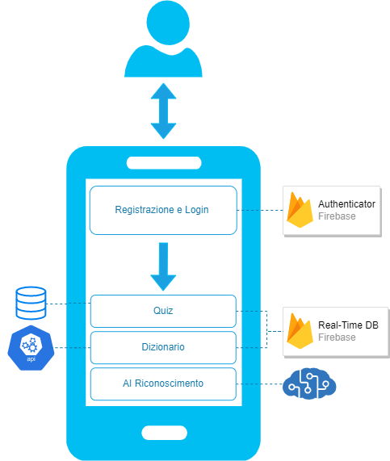

# FloralEye

Applicazione Android di supporto al riconoscimento e all’apprendimento di fiori.

## Gruppo

- Giacomo Savazzi, 845372;
- Raffaele Cerizza, 845512;
- Andrea Assirelli, 820149;

## Architettura ad Alto Livello

- **Registrazione e Login**: solo un utente registrato può utilizzare l'applicazione. Al profilo utente vengono associati una serie di dati, recuperabili nel caso di login su un'altra istanza dell'applicazione. Per la gestione di login e registrazione si utilizzano i servizi di Firebase Authenticator; 
- **Quiz**: all'utente viene sottoposto un quiz per il riconoscimento di fiori. Il quiz sfrutta un database di immagini di fiori per la formulazione delle domande. Inoltre, viene utilizzato Firebase Real-Time DB per memorizzare e recuperare i singoli quiz; 
- **Dizionario**: l'utente ha la possibilità di navigare tra diverse descrizioni di fiori, corredate da immagini. A questo proposito viene utilizzata una API per recuperare informazioni e immagini rilevanti per ciascun fiore, e Firebase Real-Time DB per memorizzare eventuali preferenze; 
- **AI Riconoscimento**: l'utente ha la possibilità di fotografare un fiore, e sottoporlo all'applicazione per il riconoscimento tramite un modello di machine learning. 

## Documentazione

Documentazione del progetto disponibile [qui](https://gitlab.com/academicunimib/unimib-laboratorio-progettazione/-/wikis/home).

Documentazione tecnica del codice disponibile [qui](https://academicunimib.gitlab.io/unimib-laboratorio-progettazione).

## Installazione

### Download del file APK

La versione più recente del file APK per il presente progetto è disponibile per il download attraverso un semplice click sul badge Release mostrato in cima al file Readme.

### Installazione del file APK su telefono Android

Per installare il file APK su telefono Android seguire questi passi:

1. Assicurarsi che il telefono supporti l'installazione da fonti sconosciute. A questo proposito, andare in Impostazioni > Sicurezza > Fonti sconosciute e verificare che lo switch per l'app di gestione dei file sia attivo.
2. Connettere il telefono al computer dove è stato scaricato il file APK tramite un cavo USB.
3. Trasferire il file APK nella storage interno del telefono.
4. Utilizzare un File Manager per individuare la locazione del file APK all'interno del telefono.
5. Toccare il file APK per avviare il processo di installazione.
6. Seguire le istruzioni mostrate a schermo per completare l'installazione. 

### Installazione del file APK su emulatore Android in Android Studio

Per installare il file APK su emulatore Android in Android Studio seguire questi passi:

1. Avviare l'emulatore di Android Studio.
2. Trascinare e rilasciare il file APK sulla finestra dell'emulatore.
3. Attendere che il processo di installazione termini.
4. Quando il processo di installazione è terminato, avviare l'applicazione dal cassetto delle applicazioni.

